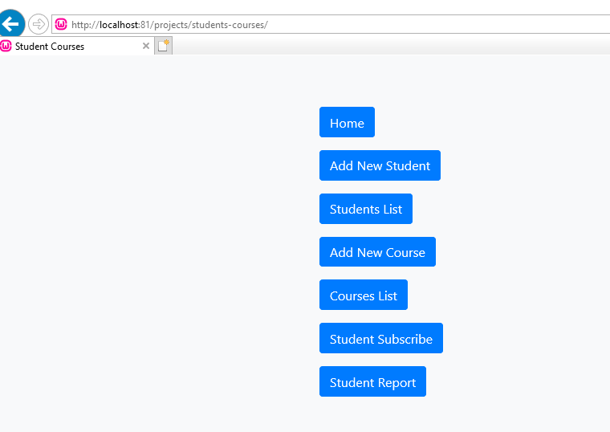

# student-courses
Sample PHP OOP Application for demo purpose | MySql - PDO -Bootstrap - Jquery

# Database : courses_db
'mysql' => array(
        'host' => '127.0.0.1',
        'username' => 'root',
        'password' => '',
        'db' => 'courses_db'
    )
    
 # Database Schema file : database/db.sql 

CREATE DATABASE courses_db COLLATE utf8_general_ci;

# Home

 
